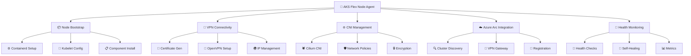
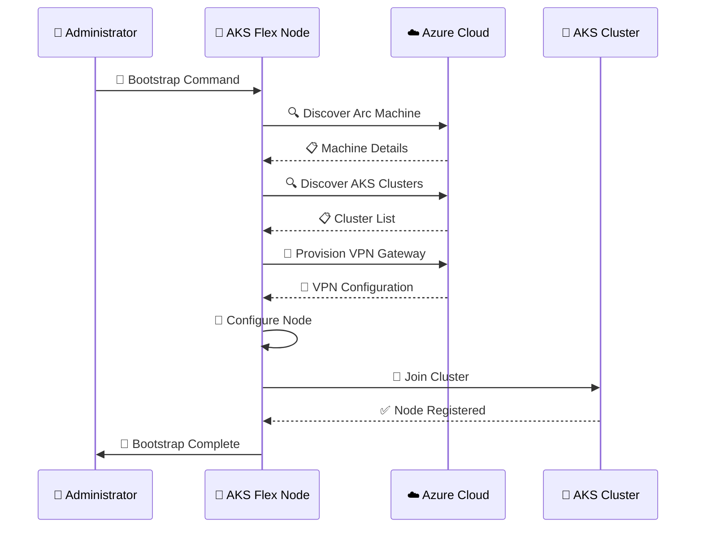
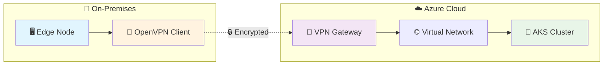
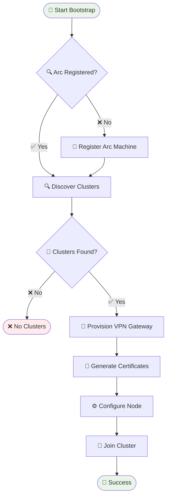
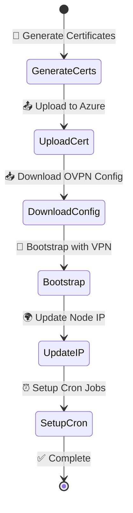
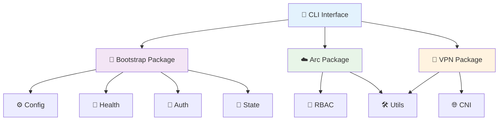

# 🚀 AKS Flex Node Agent [Work IN Progress]

**A comprehensive agent that automates AKS edge node deployment, configuration, and lifecycle operations with advanced networking and security features.**

## 📋 Table of Contents

- [🚀 AKS Flex Node Agent \[Work IN Progress\]](#-aks-flex-node-agent-work-in-progress)
  - [📋 Table of Contents](#-table-of-contents)
  - [🎯 Overview](#-overview)
    - [🌟 Core Capabilities](#-core-capabilities)
    - [🔄 System Flow](#-system-flow)
  - [✨ Key Features](#-key-features)
    - [🚀 Core Functionality](#-core-functionality)
    - [🌐 Advanced Networking](#-advanced-networking)
    - [🛡️ Security \& Authentication](#️-security--authentication)
  - [🔄 Workflows](#-workflows)
    - [🚀 Auto-Discovery Workflow](#-auto-discovery-workflow)
    - [🔐 VPN Setup Flow](#-vpn-setup-flow)
    - [🏗️ Project Architecture](#️-project-architecture)
  - [🤝 Contributing](#-contributing)
  - [📄 License](#-license)

## 🎯 Overview

The **AKS Flex Node Agent** is a next-generation Kubernetes edge node management solution designed for enterprise-grade AKS deployments. It provides seamless integration between edge nodes and Azure Kubernetes Service clusters with advanced networking, security, and automation capabilities.

### 🌟 Core Capabilities

### 🔄 System Flow

## ✨ Key Features

### 🚀 Core Functionality

| Feature | Description | Status |
|---------|-------------|---------|
| 🤖 **Auto Bootstrap** | Complete node setup with all components | ✅ Ready |
| 🔍 **Arc Discovery** | Automatic cluster detection and provisioning | ✅ Ready |
| 🌐 **VNet Integration** | Dynamic VNet discovery and configuration | ✅ Ready |
| 💚 **Health Monitoring** | Continuous health checks with self-healing | ✅ Ready |
| ⚙️ **Config Management** | Declarative YAML configuration | ✅ Ready |

### 🌐 Advanced Networking

### 🛡️ Security & Authentication

- 🔑 **Certificate Management**: Automated VPN certificate generation
- 🔐 **Secure Authentication**: Token-based Arc authentication
- 🛡️ **Network Security**: Advanced CNI policies and encryption
- 👥 **RBAC Integration**: Kubernetes role-based access control

## 🔄 Workflows

### 🚀 Auto-Discovery Workflow

### 🔐 VPN Setup Flow

### 🏗️ Project Architecture

## 🤝 Contributing

We welcome contributions! Please see our [Contributing Guide](CONTRIBUTING.md).

1. 🍴 Fork the repository
2. 🌟 Create a feature branch
3. ✅ Add tests for new functionality
4. 📝 Submit a pull request

## 📄 License

This project is licensed under the MIT License - see the [LICENSE](LICENSE) file for details.

---

**🚀 Built with ❤️ for the Kubernetes community**

